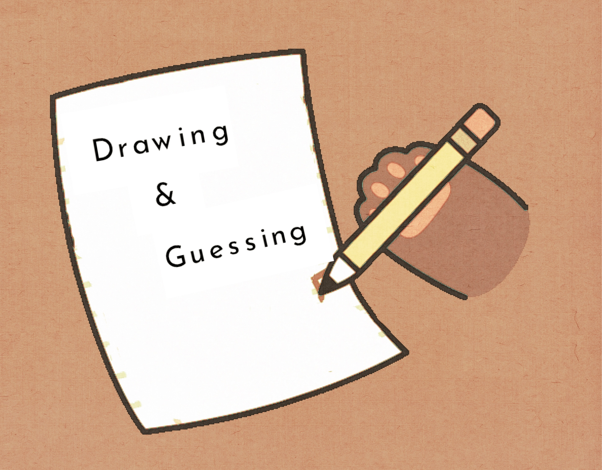

<h1 align="center">
  <br>
  
</h1>
<h1 align="center">SoPra FS23 - Drawing & Guessing</h1>
<h2 align="center"> :pencil: Introduction</h2>
Drawing & Guessing is a social drawing application that involves one participant drawing a picture based on a given word, while others attempt to correctly guess the drawing. 
To play the game, users must create a room for either two or four participants. They can invite their online friends to join. During each turn, players are designated as either "drawing player" or "guessing player".
The drawing player selects a word and has 60 seconds to draw an illustration depicting that word. During the guessing turn, participants have 60 seconds to submit their answer. Points are awarded to both the drawing and guessing players based on the accuracy of the guesses. Once the game concludes, a final ranking page is displayed to all players. The game relies on a word generating API to generate words, and a word similarity API to compare answers with the target word.

<h3 align="center">:round_pushpin: Goal</h3>
The goal of this project is to create an engaging and interactive game that allows players to draw pictures and guess each other's drawings, while earning points and competing against each other. The project aims to provide a fun and challenging experience that encourages creativity, imagination and quick thinking. The application should be an entertaining and intuitive game that can be easily played and enjoyed by people of all ages and backgrounds.

<h3 align="center">:round_pushpin: Motivation</h3>
The motivation behind a drawing and guessing game is to provide a fun, interactive, and lighthearted activity that can be played with friends, family, or even strangers. The game can be a great way to unwind after a long day, or to simply share a laugh with others. We hope our game can provide a fun and enjoyable experience for all those involved.

## :book: Table of content

- [Technologies](#technologies)
- [High-level components](#high-level-components)
- [Launch & Deployment](#launch-deployment)
- [Roadmap](#roadmap)
- [Contributions](#contributions)
- [License](#license)

## Technologies

- SpringBoot
- Gradle
- Java
- JPA
- Mockito
- RESTful API
- Google Cloud
- SonarQube

## High level components

### [GameTurnConTroller](https://github.com/sopra-fs23-group-19/sopra-fs23-group-19-server/blob/main/src/main/java/ch/uzh/ifi/hase/soprafs23/controller/GameTurnController.java)

The gameturn controller is critical to the app's functionality because it handles practically all API requests performed during the game turns. For example, it is responsible for target word setting, drawings submissions, rankings, etc.

### [GameController](https://github.com/sopra-fs23-group-19/sopra-fs23-group-19-server/blob/main/src/main/java/ch/uzh/ifi/hase/soprafs23/controller/GameController.java) && [RoomController](https://github.com/sopra-fs23-group-19/sopra-fs23-group-19-server/blob/main/src/main/java/ch/uzh/ifi/hase/soprafs23/controller/RoomController.java)

The user can view a public lobby, find existing waiting rooms and select one to join to a waiting area, then the owner of this room can start the game. And game controller controls the startings and endings of the games. After finishing each game, the game turns information will be deleted.

### [MessageController](https://github.com/sopra-fs23-group-19/sopra-fs23-group-19-server/blob/main/src/main/java/ch/uzh/ifi/hase/soprafs23/controller/MessageController.java)

Friends can play together. The user can send friend-invitations, and the others can agree or reject. And also, the user can invite his/her friends to the room, and play together.

<a name="launch-deployment"/>

## Launch & Deployment

### Setup this Template with your IDE of choice
Download your IDE of choice (e.g., [IntelliJ](https://www.jetbrains.com/idea/download/), [Visual Studio Code](https://code.visualstudio.com/), or [Eclipse](http://www.eclipse.org/downloads/)). Make sure Java 17 is installed on your system (for Windows, please make sure your `JAVA_HOME` environment variable is set to the correct version of Java).

### IntelliJ
1. File -> Open... -> SoPra server template
2. Accept to import the project as a `gradle project`
3. To build right click the `build.gradle` file and choose `Run Build`

### VS Code
The following extensions can help you get started more easily:
-   `vmware.vscode-spring-boot`
-   `vscjava.vscode-spring-initializr`
-   `vscjava.vscode-spring-boot-dashboard`
-   `vscjava.vscode-java-pack`

**Note:** You'll need to build the project first with Gradle, just click on the `build` command in the _Gradle Tasks_ extension. Then check the _Spring Boot Dashboard_ extension if it already shows `soprafs23` and hit the play button to start the server. If it doesn't show up, restart VS Code and check again.

### Building with Gradle
You can use the local Gradle Wrapper to build the application.
-   macOS: `./gradlew`
-   Linux: `./gradlew`
-   Windows: `./gradlew.bat`

More Information about [Gradle Wrapper](https://docs.gradle.org/current/userguide/gradle_wrapper.html) and [Gradle](https://gradle.org/docs/).

### Build

```bash
./gradlew build
```

### Run

```bash
./gradlew bootRun
```

You can verify that the server is running by visiting `localhost:8080` in your browser.

### Test

```bash
./gradlew test
```
### Development Mode
You can start the backend in development mode, this will automatically trigger a new build and reload the application
once the content of a file has been changed.

Start two terminal windows and run:

`./gradlew build --continuous`

and in the other one:

`./gradlew bootRun`

If you want to avoid running all tests with every change, use the following command instead:

`./gradlew build --continuous -xtest`

## Roadmap

- :negative_squared_cross_mark: Allow guessing players guess multiple times.
- :negative_squared_cross_mark: Allow live chat during the game.
- :negative_squared_cross_mark: Configurable setting of game rounds and word difficulty.
- :negative_squared_cross_mark: Display the guessing players hit or incorrectly answer in real-time.
- :negative_squared_cross_mark: Better user interface.
- :negative_squared_cross_mark: Optional re-match after a game ends.

## Contributions

### Authors

| Name        | Personal page                                                                                                                                  |
| ----------- | ---------------------------------------------------------------------------------------------------------------------------------------------- |
| Runze Li    | [](https://github.com/runzeliuzh)   |
| Jingjing Li | [](https://github.com/Jing-jing-Li) |
| Geyu Meng   | [](https://github.com/GY-Meng)      |
| Manyi Wang  | [](https://github.com/manyiw99)     |
| Shiyu Ran   | [](https://github.com/Shiyu-Ran)    |


### Acknowledgement

- The client code is based on the [SoPra FS23 - Server Template](https://github.com/HASEL-UZH/sopra-fs23-template-server).
- Many thanks to **[Mete Polat](https://github.com/polatmete)** who helped us as a Tutor and Scrum Master during this SoPra project.

**Note**  
_The cartoon cat images are from GIPHY and all credit goes to the original artists._

## License
We publish the code under the terms of the [MIT License](https://github.com/sopra-fs23-group-19/sopra-fs23-group-19-server/blob/main/LICENSE) that allows distribution, modification, and commercial use. This software, however, comes without any warranty or liability.
